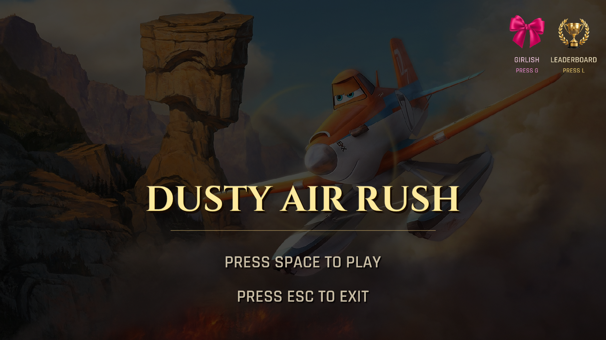

<h1 align ="center">  &nbsp; Dusty Air Rush &nbsp;  </h1>
<p align="center">
  
</p>

<p align="center">
  A fan-made 3D flying game inspired by Dusty from Disney's <i>Planes</i>, built with C++, OpenGL, GLFW, GLAD, ImGui, and an ECS-style gameplay architecture.
</p>

##  Overview

<font color="orange">`Dusty Air Rush`</font> is a stylized aerial race where Dusty flies through a curved sky track, clears scoring rings, dodges moving tornados, collects pickups, and pushes to the finish line before health runs out.

The project includes a complete menu flow, persistent scoring, themed visuals, cassette music switching, and both keyboard and gamepad support.

##  What The Game Has

- **Flight:** Steering, banking, pitch control, rolling, boost, slow-flight, backflip, headlights, and mouse-assisted look.
- **Challenges:** Procedurally placed rings, moving tornados, finish line gates, collectible coins/bows, health pickups, boundary warnings, and runway lights.
- **HUD & Progression:** Health bar, live stats (score/timer/rings), mini-map, danger overlays, popups, and persistent leaderboards.
- **Visuals:** Themed Dusty model, sky atmosphere, lit meshes, textured assets, and optional girlish mode.

##  Gameplay Loop

1. Start from the main menu.
2. Fly through ring centers to earn major score.
3. Avoid ring frames and tornados to protect health.
4. Collect coins or bows for bonus score.
5. Grab health packs when needed.
6. Reach the finish line after clearing all rings.
7. Save the final score into the leaderboard flow.

##  Controls

### Keyboard And Mouse

| Movement & Combat | Control   | Menu & Extras     | Control |
| :---------------- | :-------- | :---------------- | :------ |
| Turn left / bank  | `A` / `←` | Start / confirm   | `Space` |
| Turn right / bank | `D` / `→` | Exit / menu       | `Esc`   |
| Climb             | `S` / `↓` | Toggle headlights | `H`     |
| Dive              | `W`       | Leaderboard       | `L`     |
| Roll left         | `Q`       | Girlish mode      | `G`     |
| Roll right        | `E`       | Mouse steer       | `LMB`   |
| Boost             | `LShift`  |                   |
| Slow down         | `LCtrl`   |                   |
| Backflip / emote  | `↑`       |                   |

### Gamepad Support

| Flight Controls | Button   | Menu & Actions    | Button |
| :-------------- | :------- | :---------------- | :----- |
| Turn / pitch    | `LStick` | Start / confirm   | `A`    |
| Look / rotate   | `RStick` | Back / exit       | `B`    |
| Boost           | `RT/R2`  | Toggle headlights | `Y`    |
| Slow down       | `LT/L2`  | Backflip / emote  | `D↑`   |
| Roll right      | `RB/R1`  |                   |
| Roll left       | `LB/L1`  |                   |

##  Cassette Player

In-game cassette switching is mapped to `0` through `4`.

| Key | Track           |
| --- | --------------- |
| `0` | Engine loop     |
| `1` | انت ازاي تجرحني |
| `2` | طبيب جراح       |
| `3` | كوكب زمردة      |
| `4` | اللي قادرة      |

##  Screenshots

|                                                                                   |                                                                                          |
| :-------------------------------------------------------------------------------: | :--------------------------------------------------------------------------------------: |
|  |              |
|      |             |
|  |  |

##  Build And Run

### Requirements

- CMake `3.15+`
- A C++17-capable compiler
- OpenGL `3.3`

### Linux Packages

On Ubuntu or Debian-based systems, install:

```bash
sudo apt update
sudo apt install -y libgl1-mesa-dev libx11-dev libxrandr-dev libxi-dev libxcursor-dev libxinerama-dev
```

### Build

```bash
cmake -S . -B build
cmake --build build
```

### Run

```bash
./bin/GAME_APPLICATION
```

On Windows:

```bash
bin/GAME_APPLICATION.exe
```

### Optional Run Arguments

```bash
./bin/GAME_APPLICATION -c config/app.jsonc
./bin/GAME_APPLICATION -f 300
```

- `-c` chooses the config file.
- `-f` runs for a fixed number of frames, which is useful for testing.

##  Contributors

| <a href="https://avatars.githubusercontent.com/OmarNabil005?v=4"></a> | <a href="https://avatars.githubusercontent.com/AmiraKhalid04?v=4"></a> | <a href="https://avatars.githubusercontent.com/AliAlaa88?v=4"></a> | <a href="https://avatars.githubusercontent.com/Alyaa242?v=4"></a> |
| :------------------------------------------------------------------------------------------------------------------------------------------------------------------: | :----------------------------------------------------------------------------------------------------------------------------------------------------------------------: | :----------------------------------------------------------------------------------------------------------------------------------------------------------: | :---------------------------------------------------------------------------------------------------------------------------------------------------------: |
|                                                            [Omar Nabil](https://github.com/OmarNabil005)                                                             |                                                             [Amira Khalid](https://github.com/AmiraKhalid04)                                                             |                                                           [Ali Alaa](https://github.com/AliAlaa88)                                                           |                                                          [Alyaa Ali](https://github.com/Alyaa242)                                                           |
